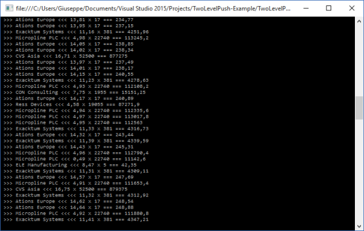

# Lightstreamer - Portfolio Demo - .NET Client

This project contains a very simple .NET Core console application implementing the *Portfolio Demo* which shows how the [Lightstreamer .NET Standard Client API](https://lightstreamer.com/api/ls-dotnetstandard-client/latest/) can be used to implement item subscriptions in COMMAND mode with "two-level push".
This example uses a library version that support the Unified Client API model (since Lightstreamer .NET Standard API 5.0.0) and therefore the explicit management of the second level of the COMMAND subscription mode. 

You can find more details about COMMAND mode subscriptions and "two-level push" in section "3.2.3 COMMAND Mode" of the [General Concepts.pdf](http://www.lightstreamer.com/docs/base/General%20Concepts.pdf) documentation.

<!-- START DESCRIPTION lightstreamer-example-portfolio-client-dotnet -->

## Details

 
### [ View live demo](http://demos.lightstreamer.com/DotNetPortfolioDemo/deploy_push.zip) 
(download deploy_push.zip; unzip it; double click on "LaunchMe" shortcut)

In the *Basic Portfolio Demo*, a virtual stock portfolio, shared among all the connected users, is handled. This demo application extends the *Basic Portfolio Demo* by combining live stock prices, [StockList Data Adapter](https://github.com/Lightstreamer/Lightstreamer-example-Stocklist-adapter-java), as in the *Stock-List Demos* with the portfolio contents, [Portfolio Data Adapter](https://github.com/Lightstreamer/Lightstreamer-example-Portfolio-adapter-java).
The updates are printed on the console and the columns show are: stock name, last price, time of the last price, quantity (number of stocks in the portfolio), and countervalue (calculated in the client application: price*quantity).

### The Code

The `Program.cs` source code file describes the main flow of the application, very simple, which involves the following sequence:
* creation of a [LightstreamerClient](https://lightstreamer.com/api/ls-dotnetstandard-client/latest/api/com.lightstreamer.client.LightstreamerClient.html) instance;
* add a custom implmentation of [ClientListener](https://lightstreamer.com/api/ls-dotnetstandard-client/latest/api/com.lightstreamer.client.ClientListener.html) interface described in the `TestConnectionListener.cs` source code file;
* call [connect()](https://lightstreamer.com/api/ls-dotnetstandard-client/latest/api/com.lightstreamer.client.LightstreamerClient.html#com_lightstreamer_client_LightstreamerClient_connect) method trying to set up a client session with the specified server;
* wait for client session go active;
* creation of a [Subscription](https://lightstreamer.com/api/ls-dotnetstandard-client/latest/api/com.lightstreamer.client.Subscription.html) containing 1 item, subscribed to in COMMAND mode. Each added row automatically provokes an underlying subscription to a sub-item in MERGE mode, to get the real-time price for that specific stock from another feed (the same as the Stock-List Demos). When a row is deleted, the underlying sub-item is automatically unsubscribed from.
* add a custom implementation of [SubscriptionListener](https://lightstreamer.com/api/ls-dotnetstandard-client/latest/api/com.lightstreamer.client.SubscriptionListener.html) interface described in the `SystemOutSubscriptionListener.cs` source code file.

<!-- END DESCRIPTION lightstreamer-example-portfolio-client-dotnet -->

## Install 

If you want to install a version of this demo pointing to your local Lightstreamer Server, follow these steps:

* Note that, as prerequisite, the [Lightstreamer - Stock- List Demo - Java Adapter](https://github.com/Weswit/Lightstreamer-example-Stocklist-adapter-java) and the [Lightstreamer - Portfolio Demo - Java Adapter](https://github.com/Weswit/Lightstreamer-example-Portfolio-adapter-java) have to be deployed on your local Lightstreamer Server instance. 
Please check out those projects and follow the installation instructions provided with them.
* Since the app is an example of **Framework-Dependent Deployment (FDD)** relies on the presence of a shared system-wide version of .NET Core on the target system.
* Launch Lightstreamer Server.
* Download the `deploy.zip` file that you can find in the [deploy release](https://github.com/Lightstreamer/Lightstreamer-example-Portfolio-client-dotnet/releases) of this project and extract the `deploy_local` folder.
* Execute the `LaunchMe.bat`.

## Build

To build and install a version of this demo, pointing to your local Lightstreamer Server instance, follow the steps below.

* Exactly as in the previous section, both the *PORTFOLIO_ADAPTER* (see the [Lightstreamer - Portfolio Demo - Java Adapter](https://github.com/Weswit/Lightstreamer-example-Portfolio-adapter-java)), and the *QUOTE_ADAPTER* (see the [Lightstreamer - Stock-List Demo - Java Adapter](https://github.com/Weswit/Lightstreamer-example-StockList-adapter-java)) are a prerequisite. The full version of the [Lightstreamer - Portfolio Demo - Java Adapter](https://github.com/Weswit/Lightstreamer-example-Portfolio-adapter-java) has to be deployed on your local Lightstreamer Server instance. Please follow the instruction in [Install the Portfolio Demo](https://github.com/Weswit/Lightstreamer-example-Portfolio-adapter-java#install-the-portfolio-demo) to install it.
* Create a new C# project: from the "New Project..." wizard, choose the ".NET Core" and then "App Console" template.
* From the "Solution Explorer", delete the default `Program.cs`.
* Add all the files provided in the `sources` folder of this project; from the "Add -> Existing Item" dialog.
* You should complete this project with the [Lightstreamer .NET Standard Client library](https://www.nuget.org/packages/Lightstreamer.DotNetStandard.Client/5.0.0-beta), to be used for the build process, trough NuGet. Follow these steps:
	* In the "Solution Explorer" tab, right click on the project and choose `Manage NuGet Packages ...`
	* In the Search text box enter `Lightstreamer`
	* Choose the <b>Lightstreamer.DotNetStandard.Client</b> last version then click `Install` and then `Ok`
	* Check out that among the References of your project <i>Lightstreamer_DotNet_Client_Unified</i> was added.
* Build solutions and run the demo. The host name and the port number of the Lightstreamer server have to be passed to the application as command line arguments. 

## See Also

### Lightstreamer Adapters Needed by This Client
<!-- START RELATED_ENTRIES -->

* [Lightstreamer - Portfolio Demo - Java Adapter](https://github.com/Weswit/Lightstreamer-example-Portfolio-adapter-java)
* [Lightstreamer - Stock-List Demo - Java Adapter](https://github.com/Weswit/Lightstreamer-example-Stocklist-adapter-java)

<!-- END RELATED_ENTRIES -->

### Related Projects

* [Lightstreamer .NET Standard Client SDK](https://github.com/Lightstreamer/Lightstreamer-lib-client-dotnet)
* [Lightstreamer - Portfolio Demos - HTML Clients](https://github.com/Weswit/Lightstreamer-example-Portfolio-client-javascript)
* [Lightstreamer - Stock-List Demos - HTML Clients](https://github.com/Weswit/Lightstreamer-example-Stocklist-client-javascript)
* [Lightstreamer - Basic Stock-List Demo - .NET Client](https://github.com/Lightstreamer/Lightstreamer-example-StockList-client-dotnet)
* [Lightstreamer - Quickstart Example - .NET Client](https://github.com/Lightstreamer/Lightstreamer-example-Quickstart-client-dotnet)

## Lightstreamer Compatibility Notes

- Compatible with Lightstreamer .NET Standard Client library version 5.0.0 or newer.
- For instructions compatible with .NET Standard Client library version 4.x, please refer to [this tag](https://github.com/Lightstreamer/Lightstreamer-example-Portfolio-client-dotnet/releases/tag/deploy_std1).
- Ensure that .NET Standard Client API is supported by Lightstreamer Server license configuration.