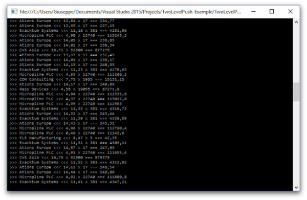

# Lightstreamer - Portfolio Demo - .NET Client

More details about COMMAND mode subscriptions and "two-level push" in section "3.2.3 COMMAND Mode" of the [General Concepts.pdf](http://www.lightstreamer.com/docs/base/General%20Concepts.pdf) documentation.

<!-- START DESCRIPTION lightstreamer-example-portfolio-client-dotnet -->

## Details

 
###[ View live demo](http://demos.lightstreamer.com/DotNetPortfolioDemo/deploy_push.zip) 
(download deploy_push.zip; unzip it; double click on "LaunchMe" shortcut)

In the *Basic Portfolio Demo*, a virtual stock portfolio, shared among all the connected users, is handled. This demo application extends the *Basic Portfolio Demo* by combining live stock prices, [StockList Data Adapter](https://github.com/Lightstreamer/Lightstreamer-example-Stocklist-adapter-java), as in the *Stock-List Demos* with the portfolio contents, [Portfolio Data Adapter](https://github.com/Lightstreamer/Lightstreamer-example-Portfolio-adapter-java).
The updates are printed on the console and the columns show are: stock name, last price, quantity (number of stocks in the portfolio), countervalue (=price*quantity);

### The Code

In particular, the code that handles the two level subscriptions is located in the *TestPortfolioListenerForExtended* class (`TestTableListener.cs`), while the *Portfolio* class (`Portfolio.cs`) simply assembles the information from the first and second level subscriptions.
The sample program logs updates and general messages on the console.

<!-- END DESCRIPTION lightstreamer-example-portfolio-client-dotnet -->

## Install 

If you want to install a version of this demo pointing to your local Lightstreamer Server, follow these steps:

* Note that, as prerequisite, the [Lightstreamer - Stock- List Demo - Java Adapter](https://github.com/Weswit/Lightstreamer-example-Stocklist-adapter-java) and the [Lightstreamer - Portfolio Demo - Java Adapter](https://github.com/Weswit/Lightstreamer-example-Portfolio-adapter-java) have to be deployed on your local Lightstreamer Server instance. 
Please check out those projects and follow the installation instructions provided with them.
* Launch Lightstreamer Server.
* Download the `deploy.zip` file that you can find in the [deploy release](https://github.com/Lightstreamer/Lightstreamer-example-Portfolio-client-dotnet/releases) of this project and extract the `deploy_local` folder.
* Execute the `LaunchMe` shortcut.

## Build

To build and install a version of this demo, pointing to your local Lightstreamer Server instance, follow the steps below.

* Exactly as in the previous section, both the *PORTFOLIO_ADAPTER* (see the [Lightstreamer - Portfolio Demo - Java Adapter](https://github.com/Weswit/Lightstreamer-example-Portfolio-adapter-java)), and the *QUOTE_ADAPTER* (see the [Lightstreamer - Stock-List Demo - Java Adapter](https://github.com/Weswit/Lightstreamer-example-StockList-adapter-java)) are a prerequisite. The full version of the [Lightstreamer - Portfolio Demo - Java Adapter](https://github.com/Weswit/Lightstreamer-example-Portfolio-adapter-java) has to be deployed on your local Lightstreamer Server instance. Please follow the instruction in [Install the Portfolio Demo](https://github.com/Weswit/Lightstreamer-example-Portfolio-adapter-java#install-the-portfolio-demo) to install it.
* Create a new C# project: from the "New Project..." wizard, choose the "Console Application" template.
* Add all the files provided in the `sources` folder of this project; from the "Add -> Existing Item" dialog.
* From the "Solution Explorer", delete the default `Program.cs`.
* You should complete this project with the Lightstreamer .NET PCL Client library, to be used for the build process, trough NuGet. Follow these steps:
	* In the "Solution Explorer" tab, right click on the project and choose `Manage NuGet Packages ...`
	* In the Search text box enter `Lightstreamer`
	* Choose Lightstreamer.DotNet.Client then click `Install` and then `Ok`
	* Check out that among the References of your project Lightstreamer_DotNet_PCL_Client was added.
* Build solutions and run the demo. The host name and the port number of the Lightstreamer server have to be passed to the application as command line arguments. 

## See Also

### Lightstreamer Adapters Needed by This Client
<!-- START RELATED_ENTRIES -->

* [Lightstreamer - Portfolio Demo - Java Adapter](https://github.com/Weswit/Lightstreamer-example-Portfolio-adapter-java)
* [Lightstreamer - Stock-List Demo - Java Adapter](https://github.com/Weswit/Lightstreamer-example-Stocklist-adapter-java)

<!-- END RELATED_ENTRIES -->

### Related Projects

* [Lightstreamer - Portfolio Demos - HTML Clients](https://github.com/Weswit/Lightstreamer-example-Portfolio-client-javascript)
* [Lightstreamer - Stock-List Demos - HTML Clients](https://github.com/Weswit/Lightstreamer-example-Stocklist-client-javascript)
* [Lightstreamer - Basic Stock-List Demo - .NET Client](https://github.com/Lightstreamer/Lightstreamer-example-StockList-client-dotnet)
* [Lightstreamer - Quickstart Example - .NET Client](https://github.com/Lightstreamer/Lightstreamer-example-Quickstart-client-dotnet)

## Lightstreamer Compatibility Notes

- Compatible with Lightstreamer .NET PCL Client library version 3.0.0 or newer.
- For Lightstreamer Allegro (+ .NET Client API support), Presto, Vivace.